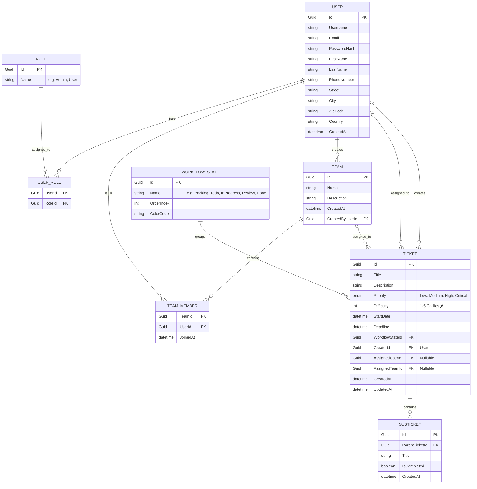

## 🗄️ Datenbankschema & Entities (ERD)

Die Datenbankstruktur (Entity Framework Core - Code First) ist streng relational und spiegelt die Bounded Contexts unseres Domain-Driven Designs (DDD) wider.

### Entity Relationship Diagram (Erster Entwurf)

### Detaillierte Entity Beschreibung

#### Identity & Access Context
*   **User (Benutzer):** Erweitert das standardmäßige `IdentityUser<Guid>`. Enthält neben Authentifizierungsdaten auch ein vollständiges Profil (Anschrift, Kontakt).
*   **Role (Rolle):** Basis-RBAC (Role-Based Access Control) zur Unterscheidung von System-Administratoren und regulären Nutzern.

#### Team Collaboration Context
*   **Team:** Ein definierter Zusammenschluss von Benutzern. Besitzt einen Namen und eine Beschreibung.
*   **TeamMember:** Die n:m Auflösungstabelle. Ein User kann in vielen Teams sein, ein Team hat viele User.

#### Ticket Management Context
*   **Ticket:** Das Kern-Aggregat (Aggregate Root). Ein Ticket *muss* einen Workflow-State und einen Ersteller haben. Es *kann* einem User **oder** einem Team zugewiesen sein. Es beinhaltet Metadaten wie Zeitraum (Start/Ende), Priorität und Schwierigkeitsgrad (`Difficulty`).
*   **Subticket:** Befindet sich innerhalb der Aggregat-Grenze des Tickets. Einfache Checklisten-Einträge ("Erledigt" / "Offen") für große Tickets.

#### Kanban & Workflow Context
*   **WorkflowState (Spalten im Kanban Board):** Die einzelnen Phasen eines Tickets (z.B. "Todo", "In Progress", "Done"). Beinhaltet die Reihenfolge (`OrderIndex`) für das Board und eine Darstellungsfarbe (`ColorCode`).
